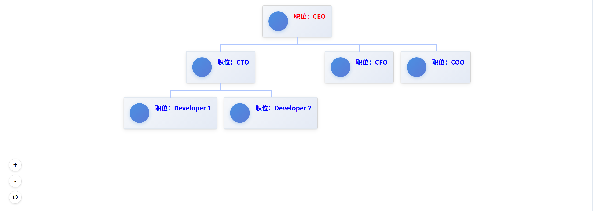

# orgchart-vue3

A Vue 3 component for displaying organizational charts with drag and zoom capabilities.

## Installation

```bash
npm install orgchart-vue3
```

## Usage

### Global Registration

```javascript
import { createApp } from 'vue'
import App from './App.vue'
import OrgChartVue3 from 'orgchart-vue3'
import 'orgchart-vue3/style.css'

const app = createApp(App)
app.use(OrgChartVue3)
app.mount('#app')
```

### Component Registration

```javascript
import { OrgChart, OrgNode } from 'orgchart-vue3'
import 'orgchart-vue3/style.css'

export default {
  components: {
    OrgChart,
    OrgNode
  }
}
```

### Template Usage

```vue
<template>
  <div>
    <org-chart :treeData="orgData" />
  </div>
</template>

<script>
import { ref } from 'vue'

export default {
  setup() {
    const orgData = ref({
      id: 1,
      name: 'CEO',
      children: [
        {
          id: 2,
          name: 'CTO',
          children: [
            { id: 5, name: 'Developer 1' },
            { id: 6, name: 'Developer 2' }
          ]
        },
        {
          id: 3,
          name: 'CFO'
        },
        {
          id: 4,
          name: 'COO'
        }
      ]
    })

    return {
      orgData
    }
  }
}
</script>
```

## Features

- **Drag and Zoom**: Navigate large organizational charts with mouse drag and zoom controls
- **Customizable Styling**: Adjust colors, borders, and line styles
- **Responsive Design**: Works well on different screen sizes
- **Vue 3 Composition API**: Built with modern Vue 3 features

## Props

### OrgChart

| Name | Type | Default | Description |
|------|------|---------|-------------|
| treeData | Object | null | The organizational chart data (required) |
| lineColor | String | '#B0C7FE' | Color of the connecting lines |
| lineWidth | String | '3px' | Width of the connecting lines |
| minScale | Number | 0.1 | Minimum zoom scale |
| maxScale | Number | 3 | Maximum zoom scale |
| scaleStep | Number | 0.1 | Zoom increment/decrement step |
| showZoomControls | Boolean | true | Show/hide zoom control buttons |


## Interactions

- **Zoom**: Use Ctrl + Mouse Wheel to zoom in/out
- **Drag**: Click and drag to pan around the chart
- **Zoom Controls**: Use the + and - buttons to zoom in/out
- **Reset View**: Use the ↺ button to reset the view to default

## Custom Node

You can customize the appearance of nodes using the default slot. Here's an example of how to create custom styled nodes:

```vue
<script setup>
import { OrgChart } from 'orgchart-vue3'
import 'orgchart-vue3/style.css'
import { ref } from 'vue'

const orgData = ref({
  id: 1,
  name: 'CEO',
  children: [
    {
      id: 2,
      name: 'CTO',
      children: [
        { id: 5, name: 'Developer 1' },
        { id: 6, name: 'Developer 2' }
      ]
    },
    {
      id: 3,
      name: 'CFO'
    },
    {
      id: 4,
      name: 'COO'
    }
  ]
})
</script>

<template>
  <div class="appbox">
    <OrgChart :treeData="orgData">
      <template #default="{ node }">
        <div :style="{ color: node.name === 'CEO' ? 'red' : 'blue' }" class="my_custom_style">
          <div class="left_area">
            <div class="avatar"></div>
          </div>
          <div class="right_area">
            <div class="name">职位：{{ node.name }}</div>
            <div class="item_desc" v-if="node.itemInfo && typeof node.itemInfo === 'object'">
              <div>角色： {{ node.itemInfo.role }}</div>
              <div>性别： {{ node.itemInfo.sex }}</div>
              <div>年龄： {{ node.itemInfo.age }}</div>
            </div>
          </div>
        </div>
      </template>
    </OrgChart>
  </div>
</template>

<style scoped>
.appbox {
  height: 600px;
  border: 1px solid #e1e8f0;
}

.my_custom_style {
  display: flex;
  background: linear-gradient(135deg, #f5f7fa 0%, #e4eaf5 100%);
  box-shadow: 0 4px 12px rgba(0, 0, 0, 0.08);
  padding: 16px;
  transition: all 0.3s ease;
  border: 1px solid #e1e8f0;
}

.my_custom_style:hover {
  box-shadow: 0 6px 16px rgba(0, 0, 0, 0.12);
  border-color: #c9d8e9;
}

.left_area {
  width: 56px;
  flex-shrink: 0;
  display: flex;
  justify-content: center;
  margin-right: 16px;
}

.avatar {
  width: 56px;
  height: 56px;
  border-radius: 50%;
  background: linear-gradient(135deg, #4a90e2 0%, #5b7bd7 100%);
  display: flex;
  align-items: center;
  justify-content: center;
  color: white;
  font-weight: bold;
  font-size: 18px;
  box-shadow: 0 3px 10px rgba(74, 144, 226, 0.3);
  position: relative;
}

.avatar::after {
  content: '';
  position: absolute;
  top: -2px;
  left: -2px;
  right: -2px;
  bottom: -2px;
  border-radius: 50%;
  background: linear-gradient(135deg, #4a90e2 0%, transparent 50%);
  opacity: 0.7;
  z-index: -1;
}

.right_area {
  flex: 1;
  min-width: 0;
}

.name {
  font-size: 18px;
  font-weight: 600;
  margin-bottom: 8px;
  white-space: nowrap;
  overflow: hidden;
  text-overflow: ellipsis;
}

.item_desc {
  background: rgba(255, 255, 255, 0.7);
  padding: 8px 12px;
  border-radius: 8px;
  border-left: 3px solid #4a90e2;
}

.item_desc div {
  margin: 4px 0;
  font-size: 14px;
  color: #4a5568;
  display: flex;
  align-items: center;
}

.item_desc div::before {
  content: '';
  display: inline-block;
  width: 6px;
  height: 6px;
  border-radius: 50%;
  background-color: #4a90e2;
  margin-right: 8px;
}
</style>
```




You can also use the `OrgNode` component to customize the node appearance:

```vue
<template>
  <org-chart :treeData="orgData" :customNode="true">
    <template #node="{ node }">
      <org-node :node="node" />
    </template>
  </org-chart>
</template>
```

## License

MIT